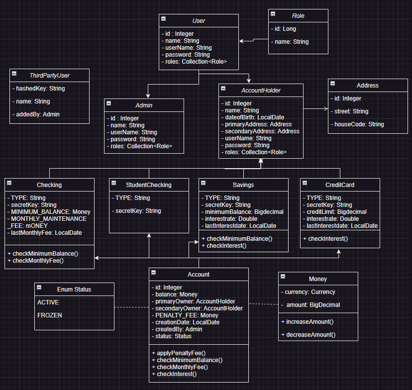
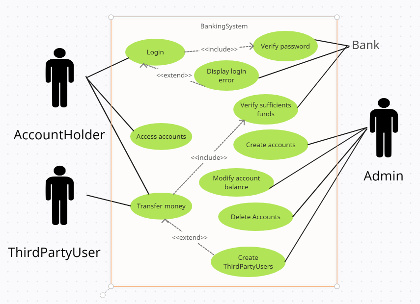

# BANKING SYSTEM - MIDTERM PROJECT

## DESCRIPTION:

Banking System is a Java application for managing day to day banking operations. 
It allows users log into their accounts and transfer money to other users accounts. Admin users can search for accounts, delete them, or modify their balance.
The application was developed using Spring Maven, and data is stored in a MySQL database.

## 🚀 FEATURES:

Admin can:
- create an account
- create a profile and edit it
- publish products for free
- edit or delete the products
- make questions
- request products

## 🛠️ APP STRUCTURE:

## 💻 HOW TO RUN THE APP 

To run the BankingSystem locally, follow these steps:

1. Clone the repository using the command: `git clone https://github.com/EugeBr/BankingSystem-Spring-MidTermProject`
2. Open the project in your preferred IDE (e.g., IntelliJ, Eclipse).
3. Set up a MySQL database
4. Navigate to the `src/main/java/com/ironhack/bankingSystem` directory and run the `bankingSystemApplication.java` file.

- You can populate the DB by running `src/test/java/com/ironhack/bankingSystem.repository.PopulateDBTest`

## 📚 TECHNOLOGIES USED

The Library Management System is implemented using various technologies that enable its development, testing, and deployment. Here are some additional details about the technologies used:

- Java 17 is the latest version of the Java programming language, which offers improved performance, security, and productivity features compared to previous versions.
- Spring Framework is a widely used Java framework that provides a flexible and modular approach to building enterprise-grade applications. It simplifies the development process by reducing boilerplate code and providing powerful features such as dependency injection, aspect-oriented programming, and transaction management.
- Spring Boot is built on top of the Spring Framework and provides an opinionated approach to building production-grade Spring applications quickly and easily. It includes embedded servers, pre-configured dependencies, and auto-configuration of Spring components, among other features.
- Maven is a popular build automation tool that simplifies the build process of Java applications. It provides a declarative way to specify the project dependencies and build steps, making it easy to manage and maintain large projects.
- MySQL is a widely used open-source relational database management system that provides a scalable and reliable platform for storing and retrieving data. It is known for its performance, reliability, and ease of use.
- JUnit 5 is a widely used testing framework for Java applications that provides a set of tools for writing and executing tests to ensure the quality and correctness of the application. It includes features such as assertions, parameterized tests, and test suites.
- IntelliJ IDEA is a popular Integrated Development Environment (IDE) for Java development that provides a comprehensive set of tools for building and debugging applications. It includes features such as intelligent code completion, refactoring tools, and debugging tools, among others.

]

## 👥 LINKS:
- TRELLO LINK : https://trello.com/b/j1OkHjuL/midterm-project

- GITHUB LINK : https://github.com/EugeBr/BankingSystem-Spring-MidTermProject

